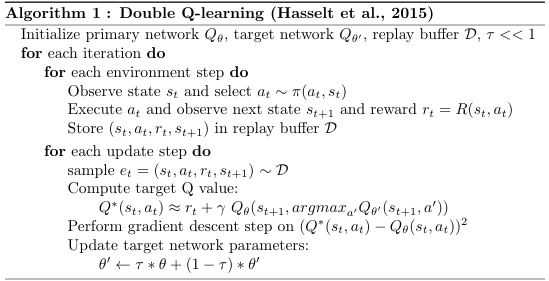
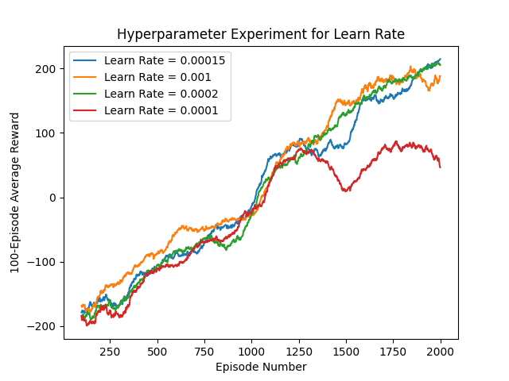
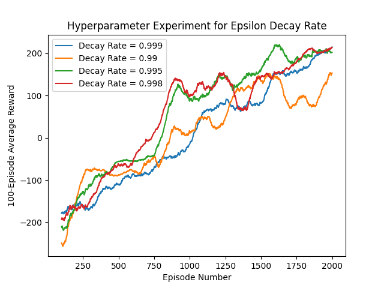
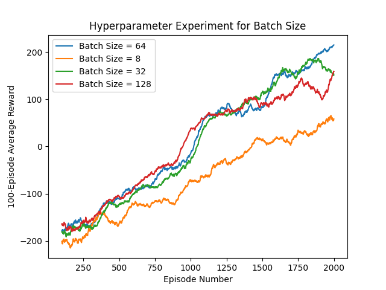
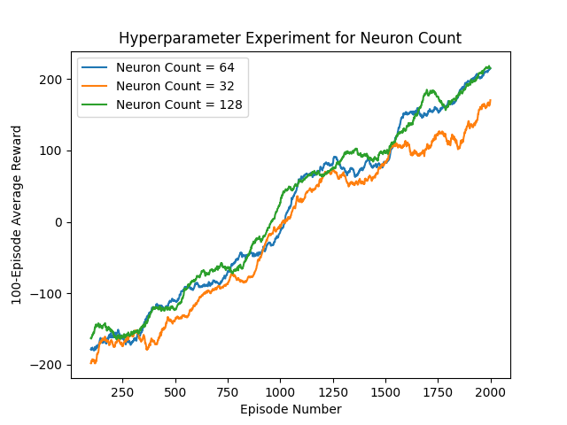

# Lunar Lander Problem
The problem consists of an 8-dimensional continuous state space and a discrete action space. The four discrete actions available are: do nothing, fire the left orientation engine, fire the main engine, fire the right orientation engine. The landing pad is always at coordinates (0,0). Coordinates consist of the first two numbers in the state vector. The total reward for moving from the top of the screen to the landing pad ranges from 100 - 140 points varying on the lander placement on the pad. If the lander moves away from the landing pad it is penalized the amount of reward that would be gained by moving towards the pad. An episode finishes if the lander crashes or comes to rest, receiving an additional -100 or +100 points respectively. Each leg ground contact is worth +10 points. Firing the main engine incurs a -0.3 point penalty for each occurrence. Landing outside of the landing pad is possible. Fuel is infinite, so, an agent could learn to fly and land on its first attempt. The problem is considered solved when achieving a score of 200 points or higher on average over 100 consecutive runs.

## States
At each time step, a tuple of size 8 is given representing the 8 states: 
$$\left( x,y,v_x,v_y,\theta,v_{\theta},leg_L,leg_R \right)$$

States in respective order:
- *x-coordinate* 
- *y-coordinate*
- *horizontal velocity* 
$$\left( v_x \right)$$
- *vertical velocity*
$$\left( v_y \right)$$
- *angle of lander with respect to verical access*
- *angular velocity of the lander*
- *boolean for if left leg is touching ground*
- *boolean for if right leg is touching ground*

## Rewards
Reward for moving from the top of the screen to the landing pad and coming to rest is about 100-140 points. If the lander moves away from the landing pad, it loses reward. If the lander crashes, it receives an additional -100 points. If it comes to rest, it receives an additional +100 points. Each leg with ground contact is +10 points. Firing the main engine is -0.3 points each frame. Firing the side engine is -0.03 points each frame. Solved is 200 points.

## RL Agent

    

## Hyperparameter Tuning and Results

    
    

    
    

